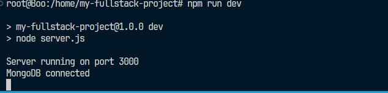

**PROJECT DIAGRAM**

<!--  -->

**PROJECT STRUCTURE**

1. app.api → Contains the API implementation. The codebase is written in ExpressJs.
2. app.tf → Contains Terraform scripts for provisioning infrastructure.
3. app.eksconfig → Contains the configuration and setup for the EKS cluster.
4. logs → This folder is automatically created after running the application.
5. .github → Contains the CI/CD pipeline configuration.
6. report-resources → Contains the images for reporting

**GIT REPO**

The repository has two branches: dev and main.

**CONNECT DB**

some *blue* text.
